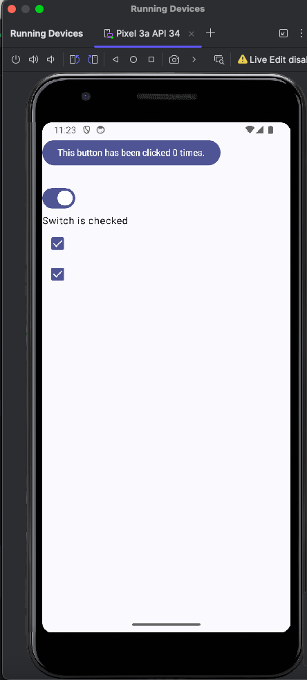
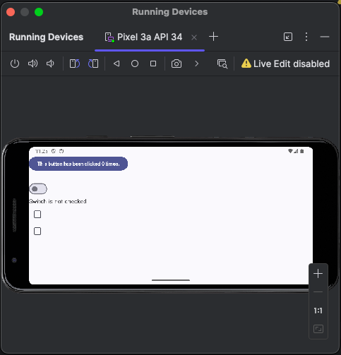

## State and configuration changes

What happens when you rotate your emulator?

The state is lost ie. it is not remembered

Recall the `remember` keyword is used to remember the state(date) between 
recompositions of a composable. To save state between configuration changes
use `rememberSavable`. When this keyword is utilzed, state will be saved not
only through recomposition but through configuration changes.

