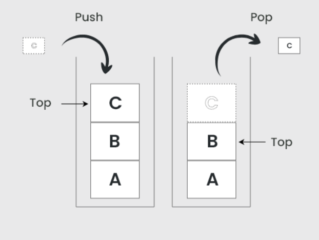

## Navigation in JetPack Compose ##

Navigating in JetPack Compose involves the use of `NavController` and `NavHost`.
NavController is responsible for managing routing information within composables 
in a mobile app. It even has a `navigate` function that can be called on it.
NavController also manages a Stack often referred to as the BackStack. It operates as 
a typical computerr stack would work. As screens (composables) are interacted with they 
are in turn added to the stack. They follow the First in last out principle.

