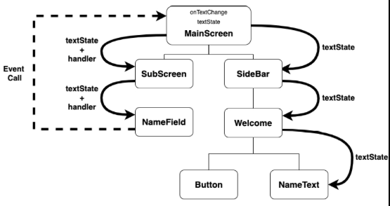

## State, Recomposition, Data flow and State Hoisting

Compose is known as a declarative language and as such it is a different 
programming paradigm used in software development. 

Recall that Imperative (Traditional) differs from Declarative Programming 
in the way control flow and logic is handled within the application.

Examples of Delarative languages include: SQL, HTML, CSS, Haskell, React, 
and JetPack Compose this differs from C, C++, Java, and Assembly (Imperative types).

In declarative type you tell the computer what you want to see or do and the computer 
determines how best to carry out task on your behalf. Imperative approach follows more 
of stepy by step procedure and explicit instructor for how best to carry out an action 
(algorithm).

Back to our discussion now of using a declarative language: Compose. 

### State

State can be thought of as application data that changes over time. Please don't confuse 
this with data contained in a variable. Compose uses a special type of variable to track 
its state. We use the keyword `remember` in compose to remember the value of data between 
recompositions (redrawings of a control) in jetPack compose. This is different behaviour 
from re-initializing a variable each time a function is called.

The common design patter employed in Compose is that of creating hierarchies out of composable 
functions. Recall that a composable function is a special function denoted with an annotation 
`@composable` and that when this function gets run it emits a new piece of UI. Moreover, we 
generate new screens in compose from nesting controls (composables) within other controls (composables). 
And when data changes, a new UI is emitted or redrawn on screen. This differs greatly from having
to manage state on your own say the way you would when doing imperative programming e.g.
`etInput = this.setText("A new piece of data passed")`

Recomposition is when the data changes in a the hierarchies of composable functions. The cool part 
here is the as soon as Compose detects a state change (data changed) it is process in composable functions
that use this date in unidrectional flow. Data flows from parent to child contol (composable) and events bubble
upwards from child to parent when invoked. The entire UI tree is not recomposed with the state changes, only the composables
that read the data will need to be recomposed (redrawn to screen) making this operation itelligent by design.


Recall, here is a stateful composable

```kotlin
// illustration of the state in the checkbox
@Composable
fun MyCheckBox(){
    var checked by remember { mutableStateOf(false)}

    Checkbox(
        checked = checked, // default assignment
        onCheckedChange = {checked = it}
    )
}
```

But wait it not a good idea to have state changed by a child composable.
State should be passed down from a parent to child composable, often referred to as Unidirectional data flow.

```kotlin
// uni-directional data flow
@Composable
fun ParentComposableFunction(){
    var isChecked by remember { mutableStateOf(false)} // state level variable

    // call child composable
    ChildComposableFunction(isChecked = isChecked, onCheckedChange = {isChecked = it})

}

@Composable
fun ChildComposableFunction(isChecked: Boolean, onCheckedChange :(Boolean) -> Unit){

    Checkbox(
        checked = isChecked,
        onCheckedChange = {checked -> onCheckedChange(checked) }
    )
}

```

Here we have hoisted the state out of composable function and placed it into a parent composable.
We then pass an event handler reference to the child composable function. WHen the checkbox is checked
it is able to update the state using the event handler reference.  This is an example of hosting the state
in a composable function. **Please note** data is passed down the hierarchary and events bubble upwards.

One advantage to having stateless composables is that composable become easier to resuse since their state is 
managed elsewhere ie. in parenet composable.


### State Hoisting ###

This idea is an important one for several reasons. Since state lives in a parent composable, any changes
to state can be passed down to other composables where required. The only requirement here is
a ancestor (parent) common to both children exists.




