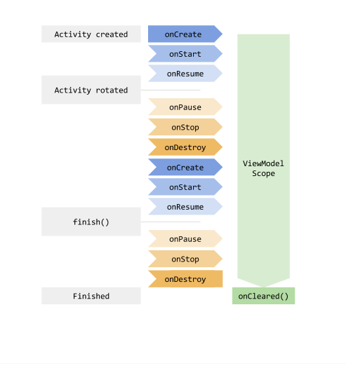

## ViewModel ##

ViewModel is a tier/component in the MVVM design pattern. ViewModel is a class 
that holds state inforamtion for a screen/composable. Its job is to expose state
to the UI. In other words it caches state and persists it through configuration 
changes, much like the `rememberSaveable` keyword ie. state is not lost when rotating 
the screen. The disclaimer here is that `rememberSaveable` only works to cache the state 
of a single composable ie. to the one its applied to whereas viewModel is globally appplied to
application, providing you initialize it in MainActivity.
eg. 
`val viewModel:MoviesViewModel = ViewModelProvider(this)[MoviesViewModel::class.java]`


A few benefits to including ViewModel in your application are as follows:
- move app in direction of clean architecture - helping to make a codebase more scable over time by better orginizing the code
- follow Separation of Concerns principal - every component in application does 1 thing well
- not have to deal with different lifecycle events ie. have the mobile app live for duration of MainActivity and have data cached
when configuration changes occur in application.



### Adding a viewModel to existing codebase ###

1. Create a viewModel to store/cache your data

```kotlin
package com.mbialowas.mvvm_movieex.data

import Movie
import androidx.compose.runtime.mutableStateListOf
import androidx.lifecycle.ViewModel
import moviesList


class MoviesViewModel(): ViewModel(){
    private val _movies = mutableStateListOf<Movie>().apply { addAll(moviesList) }
    val movies: List<Movie> = _movies


    fun toggleFavorite(movieId:Int, isFavorite: Boolean){
        val movieIndex = movies.indexOfFirst { it.id == movieId }
        if (movieIndex != -1){
            _movies[movieIndex] = _movies[movieIndex].copy(isFavorite = isFavorite)
        }
    }

}
```

 Here we have hoisted the data/state from a checkbox composable up to the 
 MoviesViewModel. After initializing the viewModel, we can pass the view model to 
 any composables that require the data and be able to modify it. How cool is that!   


```kotlin
package com.mbialowas.mvvm_movieex.screens

import Movie
import android.util.Log
import androidx.compose.foundation.border
import androidx.compose.foundation.layout.Column
import androidx.compose.foundation.layout.Row
import androidx.compose.foundation.layout.Spacer
import androidx.compose.foundation.layout.fillMaxSize
import androidx.compose.foundation.layout.fillMaxWidth
import androidx.compose.foundation.layout.height
import androidx.compose.foundation.layout.padding
import androidx.compose.foundation.layout.size
import androidx.compose.foundation.lazy.LazyColumn
import androidx.compose.foundation.lazy.items
import androidx.compose.material3.Card
import androidx.compose.material3.Checkbox
import androidx.compose.material3.Text
import androidx.compose.runtime.Composable
import androidx.compose.runtime.getValue
import androidx.compose.runtime.mutableStateOf
import androidx.compose.runtime.remember
import androidx.compose.runtime.saveable.rememberSaveable
import androidx.compose.runtime.setValue
import androidx.compose.ui.Modifier
import androidx.compose.ui.unit.dp
import com.mbialowas.mvvm_movieex.data.MoviesViewModel


@Composable
fun MovieScreen(modifier: Modifier, viewModel: MoviesViewModel) {


    LazyColumn {
        items(viewModel.movies) { movie ->
            Log.i("MJB", movie.title)
            MovieCard(
                movie = movie,
                onFavoriteChange = { isFavorite ->
                    viewModel.toggleFavorite(movie.id, isFavorite)
                }
            )
        }

    }
}

@Composable
fun MovieCard(movie: Movie, onFavoriteChange: (Boolean) -> Unit) {
    var modifier = Modifier
        .border(3.dp, androidx.compose.ui.graphics.Color.Red)
        .padding(5.dp)

    Card {
        Row(modifier = modifier) {
            Column(modifier = Modifier.padding(10.dp)) {
                Spacer(
                    modifier = Modifier
                        .fillMaxWidth(1f)
                        .height(2.dp)
                )
                Text(text = movie.title)
                Text(text = movie.description)

                Row {
                    Text(text = movie.year.toString())
                    FavCheckBox(
                        isFavorite = movie.isFavorite,
                        onCheckedChange = onFavoriteChange
                    )

                }
            }

        }
    }
}

@Composable
fun FavCheckBox(
    isFavorite: Boolean,
    onCheckedChange: (Boolean) -> Unit
) {
    var checked by rememberSaveable {
        mutableStateOf(isFavorite)
    }
    Checkbox(
        checked = isFavorite, // initial state of the checkbox
        onCheckedChange = { isChecked ->
            checked = isChecked // update the local state variable checked
            onCheckedChange(isChecked) // trigger the callback to notify parent of new state
        }
    )
}

@Composable
fun DisplayFavoriteMovies(movies: List<Movie>){
    LazyColumn {
        items(movies) { movie ->
            Log.i("FavoriteMovies: ", movie.title)
        }
    }
}

```

**Please note** the toggleFarvoite method is passed down to the checkbox event handler so that when the checkbox is checked 
the state is then tracked in the parent (MoviesViewModel). The data is passed down so that the initial state of checkbox is shown.

**Note** the data for movies is kept in a data class file - see below
```kotlin
data class Movie(
    val id: Int,
    val title: String,
    val description: String,
    val year: Int,
    var isFavorite: Boolean = false //added property to track favorite status
)
val moviesList = listOf<Movie>(
    Movie(1, "The Shawshank Redemption", "Two imprisoned men bond over several years, finding solace and eventual redemption through acts of common decency.", 1994, false),
    Movie(2, "The Crow", "Soulmates Eric and Shelly are brutally murdered when the demons of her dark past catch up with them. Given the chance to save his true love by sacrificing himself, Eric sets out to seek merciless revenge on their killers, traversing the worlds of the living and the dead to put the wrong things right.", 2024, false),
    Movie(3,"Uglies", "In a futuristic dystopia with enforced beauty standards, a teen awaiting mandatory cosmetic surgery embarks on a journey to find her missing friend.", 2024, false),
    Movie(4,"Beetlejuice Beetlejuice", "After a family tragedy, three generations of the Deetz family return home to Winter River. Still haunted by Beetlejuice, Lydia's life is turned upside down when her teenage daughter, Astrid, accidentally opens the portal to the Afterlife.", 2024, false),
    Movie(5, "Rebel Ridge", "yada yada", 2024, false )
)

```
