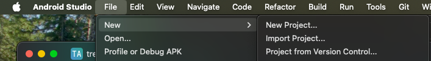
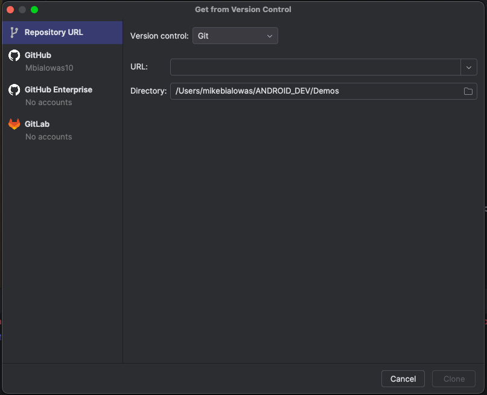
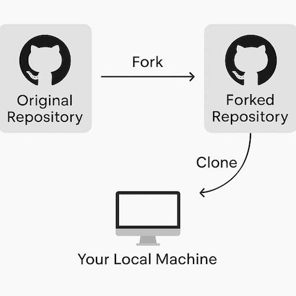

## GitHub in Android Studio

When learning a new programming language, framework, or architecture it can often 
be good to review other projects that fall into that domain.

In order to review someone elses project from gitHub import their code into Android Studio by
going to File -> New -> Project from VCS



Next, just key in URL for gitHub link and press clone



_When to clone or fork a gitHub repo?_

The difference between cloning and forking a repository on GitHub lies in ownership and purpose:

🔁 Clone
What it does: Copies a GitHub repository to your local machine.

Use case: When you want to inspect, build, or modify a project locally, but don’t plan to contribute back or don’t need your own copy on GitHub.

Command:
```kotlin
git clone https://github.com/username/repository.git
```
Ownership: You do not own the original repo. You’re just making a local copy.

🍴 Fork
What it does: Creates a copy of someone else’s repo under your own GitHub account.

Use case: When you want to contribute to a project or customize it, and possibly send a pull request to propose changes to the original repo.

How to do it: Click the Fork button on the GitHub repo page.

Ownership: You now have your own version of the repo on GitHub, which you can freely modify and push to.

Typical Workflow:
If you want to contribute to an open-source repo:

1. Fork it (makes a copy on your GitHub).
2. Clone your fork to your local machine.
3. Make changes locally.
4. Push changes to your fork.
5. Create a pull request to the original repo.




