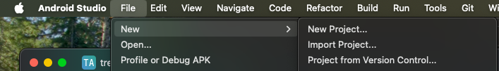
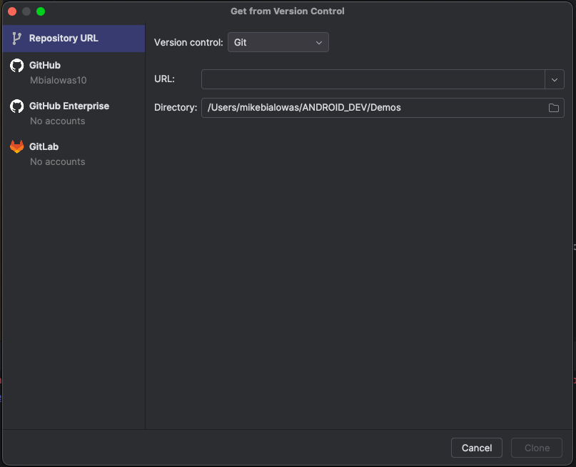

## GitHub in Android Studio

When learning a new programming language, framework, or architecture it can often 
be good to review other projects that fall into that domain.

In order to review someone elses project from gitHub import their code into Android Studio by
going to File -> New -> Project from VCS



Next, just key in URL for gitHub link and press clone



## Android Gradle Plugin (AGP)

After the clone finishes, you may encounter an error message especially when 
codebase you wish to review is writting in and older codebase or using an older version of 
AGP.

**AGP** stands for **Android Gradle Plugin** and it is responsible building, testing, and packing
Android appliations using Gradle. Gradle is Android's offical build system. Some key features of AGP include:
1. Build Automation – Automates compilation, testing, and packaging of Android apps.
2. Dependency Management – Manages dependencies for Android libraries and external modules.
3. Product Flavors & Build Variants – Supports different configurations (e.g., free vs. pro versions).
4. ProGuard & R8 – Enables code shrinking and obfuscation.
5. Resource Management – Handles resources such as layouts, drawables, and strings.
6. Jetpack Compose & View Binding – Provides tooling support for modern UI frameworks.
7. Dynamic Feature Modules – Allows modularization of apps for on-demand downloads.
8. Multi-Module Support – Enables structured app development with separate modules.

### Relationship between Plugin and Gradle
AGP is a Gradle plugin that extends Gradle for Android-specific tasks.
The Gradle Wrapper (gradlew) ensures a consistent Gradle version across development environments.
🔹 How to Use It:
In your project's build.gradle.kts (Kotlin DSL) or build.gradle (Groovy), you declare the AGP dependency:

```kotlin

// build.gradle.kts (Kotlin)
plugins {
    id("com.android.application") version "8.1.2" apply false
}
```
Version number should match the AGP version compatible with your Gradle version.

### Checking AGP Version:
You can check the AGP version in Android Studio:

```kotlin
Go to File → Project Structure → Project
Look under Android Gradle Plugin Version.
```
### Updating AGP:
To update, modify the version in your gradle.build file and sync the project.

Back to task at hand. How do we resolve the following error?


In this example, we need to downgrade teh AGP to 8.7.3

inside top-level build.gradle.kts (project gradle) file add
```kotlin
plugins {
    id("com.android.application") version "8.7.3" apply false
}
```

alternatively, just add version information to existing gradle plugin
ie. 
```kotlin
alias(libs.plugins.android.application) version "8.7.3"
```

then press sync.