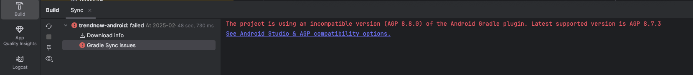

🚧 What is Gradle?

Think of Gradle as the project builder or construction manager for your Android app.

You give it a blueprint (called a build script), and Gradle takes care of:

- Downloading the tools and libraries you need 📦

- Putting all your code together 🧩

- Making sure everything works nicely 👷‍♂️

- Packaging the final app into an .apk or .aab file 📱

🧱 How does it work?

When you hit Run or Build in Android Studio, Gradle:

- Reads your instructions from special files called build.gradle.kts or build.gradle.

- Downloads dependencies — code from other people that your app uses (like Firebase or Jetpack Compose).

- Compiles your code — turns it from Kotlin or Java into machine-readable code.

- Builds your app — puts everything into a package Android can run.

🗂️ Key Gradle Files in Android Studio

| File                                  | What it does                                                                             |
| ------------------------------------- | ---------------------------------------------------------------------------------------- |
| `settings.gradle.kts`                 | Says which modules (parts of your app) to include. Think of it like a table of contents. |
| `build.gradle.kts` (Project-level)    | Sets up basic tools and plugin versions for your whole project.                          |
| `build.gradle.kts` (App/module-level) | Describes how to build your actual app: dependencies, version, SDK level, etc.           |


🧩 What are plugins and dependencies?

Plugins are tools that teach Gradle how to do something (e.g. build an Android app).

Dependencies are libraries you want to use (e.g. Firebase, Jetpack Compose, Retrofit).

You declare these in the build.gradle.kts file so Gradle knows what to include when building.

💡 Analogy
Imagine you're baking a cake:

Gradle = the baker 🧑‍🍳

Plugins = baking tools (oven, mixer, etc.)

Dependencies = ingredients (flour, sugar, etc.)

Build files = the recipe

Android Studio = your kitchen

When you click Build, Gradle follows the recipe using the tools and ingredients, and gives you the cake (your app)!


**AGP** stands for **Android Gradle Plugin** and it is responsible building, testing, and packing
Android appliations using Gradle. Gradle is Android's offical build system. Some key features of AGP include:
1. Build Automation – Automates compilation, testing, and packaging of Android apps.
2. Dependency Management – Manages dependencies for Android libraries and external modules.
3. Product Flavors & Build Variants – Supports different configurations (e.g., free vs. pro versions).
4. ProGuard & R8 – Enables code shrinking and obfuscation.
5. Resource Management – Handles resources such as layouts, drawables, and strings.
6. Jetpack Compose & View Binding – Provides tooling support for modern UI frameworks.
7. Dynamic Feature Modules – Allows modularization of apps for on-demand downloads.
8. Multi-Module Support – Enables structured app development with separate modules.

### Relationship between Plugin and Gradle
AGP is a Gradle plugin that extends Gradle for Android-specific tasks.
The Gradle Wrapper (gradlew) ensures a consistent Gradle version across development environments.
🔹 How to Use It:
In your project's build.gradle.kts (Kotlin DSL) or build.gradle (Groovy), you declare the AGP dependency:

The version number should match the Android Gradle Plugin (AGP) version compatible with your Gradle version.

```kotlin
// build.gradle.kts (Kotlin)
plugins {
    id("com.android.application") version "8.1.2" apply false
}
```

### Checking AGP Version:
You can check the AGP version in Android Studio:

```kotlin
Go to File → Project Structure → Project
Look under Android Gradle Plugin Version.
```
### Updating AGP:
To update, modify the version in your gradle.build file and sync the project.

How would you resolve the following error?



In this example, we need to downgrade teh AGP to 8.7.3

inside top-level build.gradle.kts (project gradle) file add
```kotlin
plugins {
    id("com.android.application") version "8.7.3" apply false
}
```

Alternatively, just add version information to existing gradle plugin
ie. 
```kotlin
alias(libs.plugins.android.application) version "8.7.3"
```

then press sync.

### Remember

After you have cloned a gitHub repo, you may encounter an error message especially when the
codebase you wish to review is older than the AGP Android Studio is set to use.


