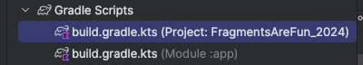
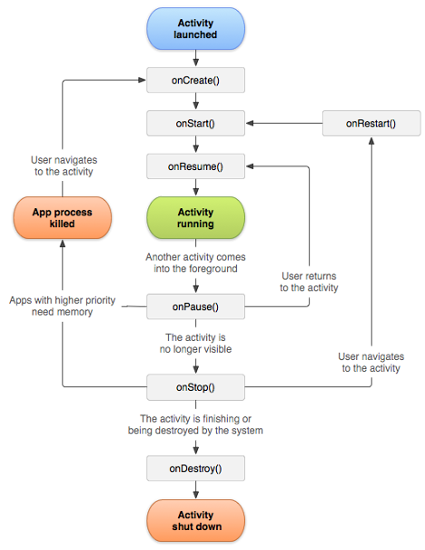

## Components of Android App

<!--  -->

### 0. Gradle

- A tool used to automate the compilation and project build process in Android Studio. Typical workflow involves using Gradle build scripts to download and install third-party libraries and to configure the project.



There are 2 build files as shown above. 
1. build.gradle.kts(Project level)
2. buildgradle.kts(Moudle level)

* Project level contains 2 plugins - these are used to complile and build your project. Module level gradle file 
dependencies section contains 3rd party libraries you wish to add to your applicaton.

**Please note** the dependencies section of module level gradle file doesn't contain any library version numbers. To locate version information, please see libs.versions.toml

build.gradle.kts
```
dependencies {

    implementation(libs.androidx.core.ktx)
    implementation(libs.androidx.appcompat)
    implementation(libs.material)
    implementation(libs.androidx.activity)
    implementation(libs.androidx.constraintlayout)
    testImplementation(libs.junit)
    androidTestImplementation(libs.androidx.junit)
    androidTestImplementation(libs.androidx.espresso.core)
}
```
libs.versions.toml
```
[versions]
agp = "8.5.1"
kotlin = "1.9.0"
coreKtx = "1.13.1"
junit = "4.13.2"
junitVersion = "1.2.1"
espressoCore = "3.6.1"
appcompat = "1.7.0"
material = "1.12.0"
activity = "1.9.1"
constraintlayout = "2.1.4"

[libraries]
androidx-core-ktx = { group = "androidx.core", name = "core-ktx", version.ref = "coreKtx" }
junit = { group = "junit", name = "junit", version.ref = "junit" }
androidx-junit = { group = "androidx.test.ext", name = "junit", version.ref = "junitVersion" }
androidx-espresso-core = { group = "androidx.test.espresso", name = "espresso-core", version.ref = "espressoCore" }
androidx-appcompat = { group = "androidx.appcompat", name = "appcompat", version.ref = "appcompat" }
material = { group = "com.google.android.material", name = "material", version.ref = "material" }
androidx-activity = { group = "androidx.activity", name = "activity", version.ref = "activity" }
androidx-constraintlayout = { group = "androidx.constraintlayout", name = "constraintlayout", version.ref = "constraintlayout" }
```

### 1. Android Lifecycle – Activities/Fragments

- See Imperative Android Lifecycle app. Please note that JetPack Compose simplifies this
lifecycle in that all lifecycle phases scoped to main composable function.
  
  [LifeCycle Demo](https://github.com/Mbialowas10/Android-LifeCycle-Kotlin)

- **Activity** – just becomes a screen and each activity has 7 methods associated with it.
  1. `onCreate` – gets called when activity is created
  2. `onRestart` – gets called when activity restarts
  3. `onStart` – gets called after activity is created
  4. `onResume` – focus is given back to the app
  5. `onPause` – app is paused, focus is given to another app
  6. `onStop` – app is stopped, focus is given to another app, e.g., answering a phone call
  7. `onDestroy` – app is closed/exited




### 2. The Manifest

- Every project must have a manifest file. What can be found in this file?
  1. Components of app: screens/activities, services, receivers, providers
  2. Permissions
  3. Hardware/software settings
  4. Launch Screen (Activity)

