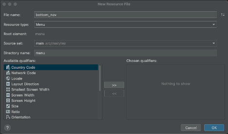
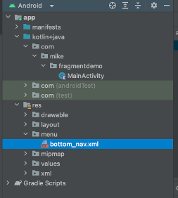
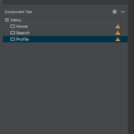
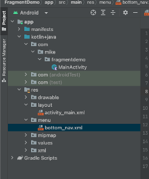
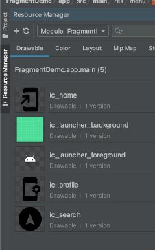

## Fragments

<!--  -->


### Why Use Fragments?
- Reusable part of UI (module-like)
- Similar to an Activity in that there is an XML and code file, but…
  - Fragments are defined on an Activity
- Useful when you need to update a portion of the screen; one good use case is for navigation.

### Things of Importance:
- Fragments need to be loaded into a `FragmentContainer` for display in an emulator/device.
- A menu resource, a.k.a. a menu, should be loaded directly into a `BottomNavigationView`.

### Creating Navigation in App:
1. Right-click on `res -> layout` folder, then click on **New Resource File**.
2. Select **Menu** under Resource type.



   A new directory called `menu` gets created with `bottom_nav.xml` residing in it.



3. Create 3 menu items by dragging widgets under the component tree, rename each menu item to the following: Home, Search, and Profile. This can be done by setting the value of the `title` property.

    
4. Create a new layout called `nav`, then drag a `FrameLayout` widget.

5. You can now create/use a few images for the menu items by clicking on **Resource Manager** (found along the left-hand menu of the screen).

    

6. Click the `+` sign to add a new image resource.

    

7. Select **Vector Asset**, click **Clip Art**, find an image, then rename it. It’s a good idea to use `ic_name` to indicate an icon.

8. Add `BottomNavigationView` to `activity_main.xml`. This can be done by setting the menu property in `activity_main` to the `bottom_nav.xml` menu we created. The XML attributes should match these:

   ```xml
   <com.google.android.material.bottomnavigation.BottomNavigationView
       android:id="@+id/bottom_navigation"
       android:layout_width="match_parent"
       android:layout_height="wrap_content"
       android:layout_gravity="start"
       android:background="?attr/colorPrimary"
       app:menu="@menu/bottom_nav" />
   ```

9. Lastly, add icons to `bottom_nav.xml` file.

   The `activity_main.xml` file should now look like:

   ```xml
   <RelativeLayout xmlns:android="http://schemas.android.com/apk/res/android"
       xmlns:app="http://schemas.android.com/apk/res-auto"
       xmlns:tools="http://schemas.android.com/tools"
       android:layout_width="match_parent"
       android:layout_height="match_parent"
       tools:context=".MainActivity">

       <FrameLayout
           android:id="@+id/fragment_container"
           android:layout_width="match_parent"
           android:layout_height="match_parent"
           android:layout_above="@id/bottom_navigation" />

       <com.google.android.material.bottomnavigation.BottomNavigationView
           android:id="@+id/bottom_navigation"
           android:layout_width="match_parent"
           android:layout_height="wrap_content"
           android:layout_alignParentBottom="true"
           app:menu="@menu/bottom_nav" />
   </RelativeLayout>
   ```

10. Create 3 blank fragments: `HomeFragment`, `SearchFragment`, and `ProfileFragment`.

   It might be easiest to preview the GitHub repo for additional implementation details.

11. The `MainActivity` code file should contain the following code:

   ```kotlin
   class MainActivity : AppCompatActivity() {
       private lateinit var bottomNavigationView: BottomNavigationView

       override fun onCreate(savedInstanceState: Bundle?) {
           super.onCreate(savedInstanceState)
           setContentView(R.layout.activity_main)

           bottomNavigationView = findViewById(R.id.bottom_navigation)
           bottomNavigationView.setOnNavigationItemSelectedListener { menuItem ->
               when (menuItem.itemId) {
                   R.id.nav_home -> {
                       loadFragment(HomeFragment())
                       true
                   }
                   R.id.nav_search -> {
                       loadFragment(SearchFragment())
                       true
                   }
                   R.id.nav_profile -> {
                       loadFragment(ProfileFragment())
                       true
                   }
                   else -> false
               }
           }
       }

       private fun loadFragment(fragment: Fragment) {
           val transaction = supportFragmentManager.beginTransaction()
           transaction.replace(R.id.fragment_container, fragment)
           transaction.commit()
       }
   }
   ```

   Here we can see that we register the `bottomNavBar` in our code, then call an event handler to grab the `menuItem` ID, which becomes mapped to the fragment we load into the `FragmentContainer`. Happy Coding!

### Resources:
1. GitHub: [Navigation With Fragments in Kotlin](https://github.com/Mbialowas10/NavigationWithFragmentsInKotlin)   
