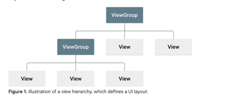

## Imperative (Traditional) Android Development

### Views

- A piece of UI, think of it as a box.
- For more, please see [Android Views Documentation](https://developer.android.com/develop/ui/views/layout/declaring-layout).
- A view serves as the base class for UI components.

### ViewGroup
- Can hold 0 or more views; think of `ViewGroup` as a Layout.
- Example views:
  - `TextView`
  - `ImageView`
  - `Button`
  - `EditText`
  - `ListView`
  
### Identifying Views
- All views should have a unique identifier to be able to use it (i.e., bind it to your code).
  
```xml
<Text android:id="@+id/mytext"/>
```

### Binding Layout to Code
- You can bind this layout to your Kotlin/Java code as follows:
  
```kotlin
val label: TextView = findViewById(R.id.text)
```

### Attributes
- Views have attribute properties similar to CSS in web development.

### Demonstration of Widgets
- For demonstration of widgets, please see:
  - [widgetsDemo on GitHub](https://github.com/Mbialowas10/widgetsDemo)


- Added to GitHub for reference.

---