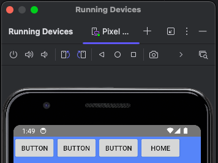
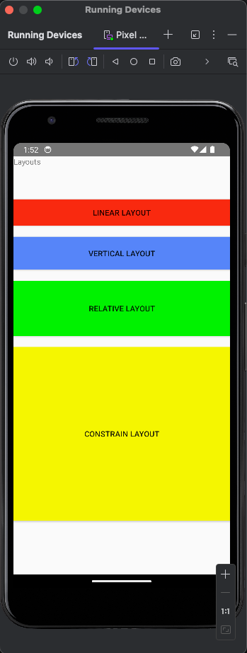

## Layouts In Imperative Programming

### Resources:
- [LayoutDemo project](https://github.com/Mbialowas10/LayoutDemo2024)

### Overview
- Every XML file must have a View or View Group assigned to it.
  - A View is a piece of UI the user sees on the screen.
  - A View Group is invisible but is used to create a structure of the UI layout.
  - A View Group is typically made-up of many Views

### Compilation
- Each XML file gets compiled into a view, i.e., a piece of UI.

### Layout Types Available:
1. **Linear Layout** – horizontal or vertical placement.


Or


2. **Relative Layout** – relative to another element.
3. **Web View** – display webpage.
4. **Constraint Layout** – like relative layout in a flattened structure.

**Note:** Web View, Relative, Grid Layout have be depecated in Koala Release of Androide Studio.

### List View:
- Displays child items in vertical fashion.

### Linear Layout:
- Displays children in horizontal or vertical fashion.

### Tips and Tricks
  
- It is important to regularly check the `Manifest.xml` file especially 
after adding new Layout files and code files.

- Intents make it easy to navigate from one screen to the next.
```kotlin
btnConstraint.setOnClickListener{
                val intent = Intent(this,ConstraintActivity::class.java)
                startActivity(intent)
            }
```

Or Altertively to other applications within Android OS. eg. mail client, web browser, text to speach recognition, 
or to social media platforms, etc...


