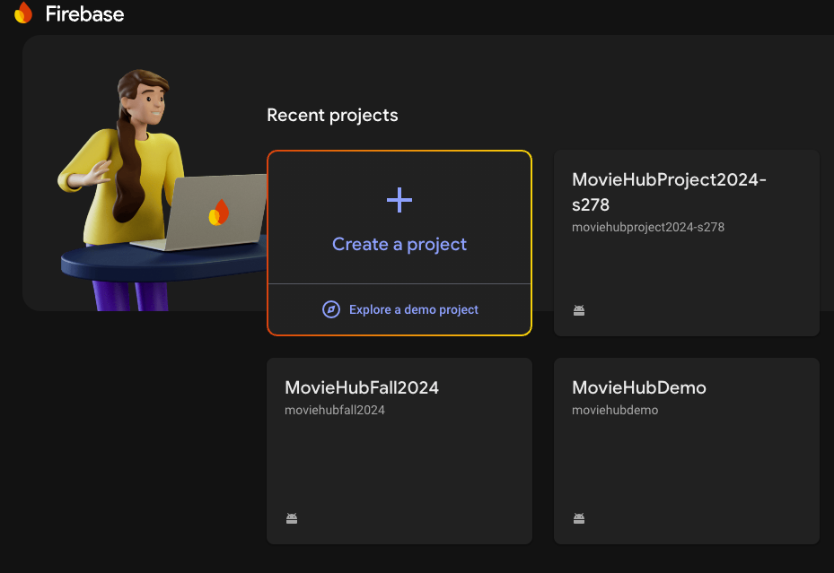
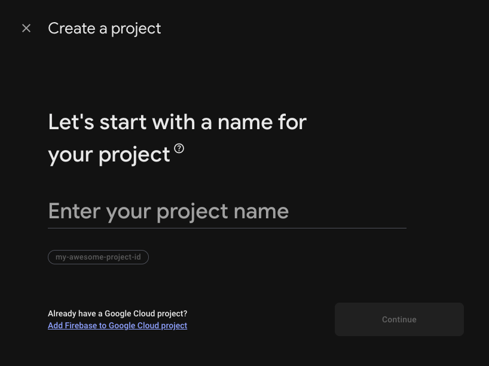
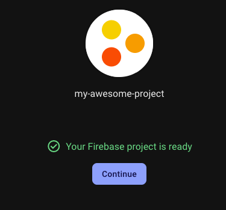

## Firebase Services ##

Firebase is a suite of tools and online services. 
You can find web hosting, databases, and even Authenticaion
Libraries in the Firebase Collection.

In this course, we will be exploring 
FireStore database and Authentication modules.

You need to have a google account in order to use Firebase Services.
You can create a new Firebase project by visisting,
`console.firebase.google.com`

1. Creata Project - enter a project name click continue.

2. Turn off Google Analytics

3. Click continue to create project, then wait...

4. Click continue, once project created...

5. Select Android Project type
