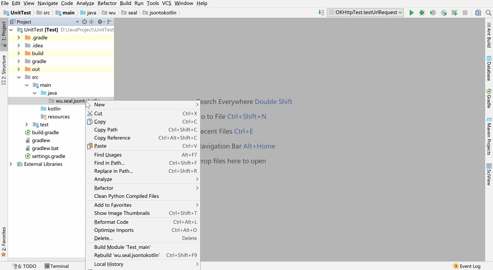

## RetroFit -  A type-safe HTTP client for Android and Java ##

Retrofit turns an HTTP API into a Java/Kotlin Interface. Retrofit is 
typically used with Moshi. Moshi is a modern JSON library for Android, Java and Kotlin. 
It makes it easy to parse JSON into Java and Kotlin classes. Additionally, 
Kotlin Data class Android Studio plugin are used together. By using these tools, developers
are able to automate part of process involved in mapping an http json response to Kotlin
classes.

## JSON to Kotlin class plugin ##


The code snippets that follow demonstrate how you can include these libraries within your project.

## libs.versions.toml ##
```kotlin
[versions]
moshiKotlin = "1.9.3"
converterMoshi = "2.9.0"

[libraries]
moshi-kotlin = { module = "com.squareup.moshi:moshi-kotlin", version.ref = "moshiKotlin" }
converter-moshi = { module = "com.squareup.retrofit2:converter-moshi", version.ref = "converterMoshi" }
```

## build.gradle.kts (Module :app) ##
```kotlin
dependencies {
    // moshi
    implementation(libs.moshi.kotlin)
    implementation(libs.converter.moshi)
}
```

1. Setup object Api
```kotlin
    object Api {
    private val BASE_URL = "https://api.themoviedb.org/3/"


    // convert json into objects that project code can understand
    private val moshi = Moshi.Builder()
        .add(KotlinJsonAdapterFactory())
        .build()

    //initialize retrofit
    private val retrofit = Retrofit.Builder()
        .addConverterFactory(MoshiConverterFactory.create(moshi))
        .baseUrl(BASE_URL)
        .build() // now able to use it

    val retrofitService: MoviesService by lazy {
        retrofit.create(MoviesService::class.java)
    }
}
```

2. Setup manager to fetch data from API. 

```kotlin
    class MoviesManager(database: AppDatabase) {
    private var _moviesResponse = mutableStateOf<List<Movie>>(emptyList()) // top level api
    val api_key:String="<replaceWithKey>"

    val moviesResponse: MutableState<List<Movie>> // state allows us to make data available to other classes
        @Composable get() = remember{
            _moviesResponse
        }


    init{
        getMovies(database)
    }
    private fun getMovies(database: AppDatabase) {
        val service = Api.retrofitService.getTrendingMovies(api_key)

        service.enqueue(object : Callback<MovieData> {
            override fun onResponse(
                call: Call<MovieData>,
                response: retrofit2.Response<MovieData>
            ) {
                if (response.isSuccessful){
                    Log.i("Data", "Data Loaded")
                    //val movieData = response.body()
                    //Log.i("DataStream", movieData.toString())
                    _moviesResponse.value = response.body()?.results?: emptyList()
                    Log.i("DataStream", _moviesResponse.toString())

                    GlobalScope.launch {
                        saveDataToDatabase(database = database, _moviesResponse.value)
                    }
                }
            }

            override fun onFailure(call: Call<MovieData>, t: Throwable) {
                Log.d("error", "${t.message}")
            }

        })


    }
    private suspend fun saveDataToDatabase(database: AppDatabase, movies: List<Movie>){
        database.movieDao().insertAllMovies(movies)
    }
}
```

3. Define an Interface for all our endpoints!

```kotlin
   interface MoviesService {
    @GET("trending/movie/day")
    fun getTrendingMovies(@Query("api_key") apiKey: String): Call<MovieData> // call the parent

    @GET("search/movie")
    fun searchMovieByName(
        @Query("api_key") apiKey:String,
        @Query("query") query: String) : Call<MovieData>
} 
```

**Things to Note:** 
    1. Annotations are used here to, much like they are with Room library. Here 
    we can see `@GET`, `@Query` being used within the MoviesService Interface.
    2. dependencies have to be added to gradle files before libraries can be used.
    3. When using Retrofit, Moshi, and JSON to Kotlin class plugin developer save alot of time from having to write code from scratch.

Moshi is reponsisble for serializing and deserializing the data from API to kotlin objects. There are other similar tools on the market
such as GSON.

