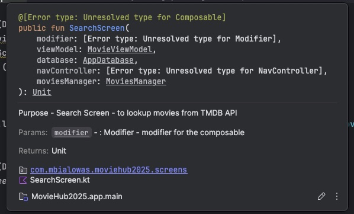

## KDoc

Having your codebase documented helps you and others understand your 
programming logic, helping in debugging, or simply trying to remember what the code
does at a later date. This is where documentation comes in to play. 

A side benefit to documenting your codebase is that you can understand
purpose of code without going into its implementation. 

```kotlin
/**
 * Purpose - Search Screen - to lookup movies from TMDB API
 * @param modifier: Modifier - modifier for the composable
 * @param viewModel: MovieViewModel - view model for the composable
 * @param database: AppDatabase - database for the composable
 * @throws N/A
 * @constructor Emits a new SearchScreen
 * @return Unit
 */
@Composable
fun SearchScreen(
    modifier: Modifier,
    viewModel: MovieViewModel,
    database: AppDatabase,
    navController: NavController,
    moviesManager: MoviesManager
){
    // body of function here ...
}
```

When a user type in function name or hovers mouse over function name, the following documentation appears.

